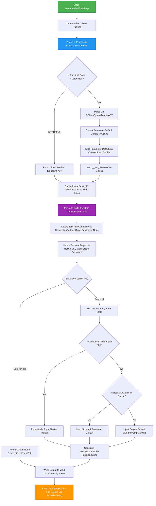
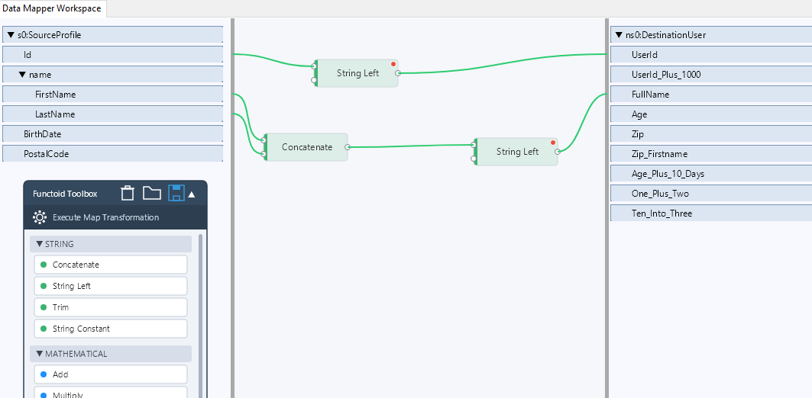

# SkiaMapper XSLT Generation Engine

A robust, decoupled backend compilation engine that transforms a visual, graph-based canvas data topology into high-performance, valid XSLT 1.0 style sheets. 

This engine is specifically engineered to handle complex data mapping pipelines using **Roslyn AST syntax manipulation** to dynamically bridge structural type mismatches between native XSLT platforms and custom C# extension script fragments.

---

## Core Mapping Paradigm

The transformation process relies on loading an **Input XML Schema** (defining the incoming data profile) and a **Desired Output XML Schema** (defining the expected target data format) to initialize the visual design workspace. This architectural concept is directly equivalent to **BizTalk Server Mapping**, where users visually bridge source schemas to destination schemas using a canvas, links, and functional transformation blocks (functoids). 

Once the data paths are visually modeled, the engine compiles the graphical layout into a standalone XSLT stylesheet that executes the structural translation at runtime.

---

## Technical Architecture & Pipeline Flow

The compilation process is split into two phases: an initial **Script Sanitization Phase** that uses a Roslyn parser to scrape and prepare script signatures, followed by a **Backward-Tracing Recursive Tree Construction Phase** anchored on downstream destination elements.


## Core Engine Components

## 🧩 Built-In Functoids Catalog template (`BuiltInFunctoids.xml`)

BuiltInFunctoids.xml serves as the extensible configuration template for all pre-built mapping functions (**Functoids**) in the visual palette. Developers can use this template as a base to add new custom functoids or modify existing implementations. It specifies UI categorization, inline C# code-generation formats, and full Roslyn-analyzable implementation scripts.

---

### 🎨 Categories & Palette Colors

| Category ID | Category Name | Color | Description |
| :---: | :--- | :--- | :--- |
| **1** | `String` | `MediumSeaGreen` | Text manipulation, concatenation, substring, and trim logic. |
| **2** | `Mathematical` | `DodgerBlue` | Arithmetic operations (addition, multiplication, variadic operations). |
| **3** | `Logical` | `Orange` | Conditional evaluation and logical comparisons. |
| **4** | `Date` | `Orchid` | Date parsing, current date generation, age computation, and date math. |
| **5** | `Conversion` | `Coral` | Type casting and format conversions. |
| **6** | `Scientific` | `SteelBlue` | Higher-level mathematical and statistical routines. |
| **7** | `DataBase` | `Goldenrod` | Relational SQL lookups and query-based parameter resolution. |

---

### 🔧 Functoid Specifications

#### 🔤 String Functoids (`catId="1"`)

* **Concatenate** (`Id: 100`)
  * **Code Format:** `string.Concat({0})` (Join Operator: `, `)
  * **Script:**
    ```csharp
    public string Concatenate(params string[] args) {
        return string.Concat(args);
    }
    ```
* **String Left** (`Id: 110`)
  * **Code Format:** `{0}.Substring(0, Math.Min({0}.Length, {1}))`
  * **Script:**
    ```csharp
    public string StringLeft(string str, int length) {
        if (string.IsNullOrEmpty(str)) return string.Empty;
        return str.Substring(0, Math.Min(str.Length, length));
    }
    ```
* **Trim** (`Id: 120`)
  * **Code Format:** `{0}?.Trim()`
  * **Script:**
    ```csharp
    public string Trim(string str) {
        return str?.Trim() ?? string.Empty;
    }
    ```
* **String Constant** (`Id: 130`)
  * **Code Format:** `"{0}"`
  * **Script:**
    ```csharp
    public string StringConstant(string constantValue) {
        return constantValue ?? string.Empty;
    }
    ```

---

#### ➕ Mathematical Functoids (`catId="2"`)

* **Add** (`Id: 200`)
  * **Code Format:** `({0})` (Join Operator: ` + `)
  * **Script:**
    ```csharp
    public double Add(params double[] values) {
        double sum = 0;
        foreach(var v in values) sum += v;
        return sum;
    }
    ```
* **Multiply** (`Id: 210`)
  * **Code Format:** `({0},{1})` (Join Operator: ` * `)
  * **Script:**
    ```csharp
    public double Multiply(params double[] values) {
        if (values.Length == 0) return 0;
        double result = 1;
        foreach(var v in values) result *= v;
        return result;
    }
    ```

---

#### 📅 Date Functoids (`catId="4"`)

* **Add Days** (`Id: 300`)
  * **Code Format:** `DateTime.Parse({0}).AddDays({1}).ToString("yyyy-MM-dd")`
  * **Script:**
    ```csharp
    public string AddDays(string dateStr, string daysStr) {
        if (string.IsNullOrEmpty(dateStr)) return "";
        if (!double.TryParse(daysStr ?? "0", out double days)) return dateStr;
        if (DateTime.TryParse(dateStr, out DateTime dt)) {
            dt = dt.AddDays((int)days);
            return dt.ToString("yyyy-MM-dd");
        }
        return dateStr;
    }
    ```
* **Current Date** (`Id: 310`)
  * **Code Format:** `DateTime.Now.ToString("yyyy-MM-dd")`
  * **Script:**
    ```csharp
    public string CurrentDate() {
        return DateTime.Now.ToString("yyyy-MM-dd");
    }
    ```
* **To Age** (`Id: 310`)
  * **Code Format:** `DateTime.Now.ToString("yyyy-MM-dd")`
  * **Script:**
    ```csharp
    public static int ToAge(DateTime birthDate) {
        DateTime today = DateTime.Today;
        if (birthDate > today) {
            throw new ArgumentOutOfRangeException(nameof(birthDate), "Birthdate cannot be in the future.");
        }
        int age = today.Year - birthDate.Year;
        if (birthDate.Date > today.AddYears(-age)) {
            age--;
        }
        return age;
    }
    ```

---

#### 🗄️ Database Functoids (`catId="7"`)

* **Database Lookup** (`Id: 700`)
  * **Code Format:** `DatabaseLookup({0}, {1}, {2}, {3})`
  * **Script:**
    ```csharp
    public string DatabaseLookup(string lookupValue, string connectionString, string tableName, string columnName) {
        if (string.IsNullOrEmpty(lookupValue) || string.IsNullOrEmpty(connectionString)) return string.Empty;
        if (string.IsNullOrEmpty(tableName) || string.IsNullOrEmpty(columnName)) return string.Empty;
        
        string cleanTable = System.Text.RegularExpressions.Regex.Replace(tableName, @"[^A-Za-z0-9_]", "");
        string cleanColumn = System.Text.RegularExpressions.Regex.Replace(columnName, @"[^A-Za-z0-9_]", "");
        string query = $"SELECT [{cleanColumn}] FROM [{cleanTable}] WHERE [Id] = @Param";
        
        try {
            using (var conn = new System.Data.SqlClient.SqlConnection(connectionString))
            using (var cmd = new System.Data.SqlClient.SqlCommand(query, conn)) {
                cmd.Parameters.Add(new System.Data.SqlClient.SqlParameter("@Param", lookupValue));
                conn.Open();
                var result = cmd.ExecuteScalar();
                return result != null ? result.ToString() : string.Empty;
            }
        }
        catch (Exception ex) {
            return string.Empty;
        }
    }
    ```

---

### 📐 Configuration XML Schema

When extending or adding custom functoids to `BuiltInFunctoids.xml`, adhere to the following schema structure:

```xml
<BuiltInFunctoids>
  <Categories>
    <Category Color="ColorNameOrHex" Id="1" name="CategoryName"/>
  </Categories>
  
  <Functoid Id="UniqueFunctoidId" catId="CategoryId" name="FunctoidDisplayName">
    <MethodNameFormat>FormatPatternForCodeGeneration</MethodNameFormat>
    <JoinOperator>, </JoinOperator> <!-- Optional: Used for variadic params -->
    <ScriptTemplate>
      <![CDATA[
      // C# method implementation analyzed by Roslyn at runtime
      ]]>
    </ScriptTemplate>
  </Functoid>
</BuiltInFunctoids>
```
### 1. `XsltMapGenerator`
The master compilation block that converts graph nodes and wire configurations into standard-compliant XSLT files[cite: 3]. It coordinates the data lifecycle through two explicit execution layers:

* **Roslyn AST Signature Stripping:** Scans customized `FunctoidInstance` scripts using C# syntax nodes[cite: 3]. It automatically isolates parameter value defaults (e.g., `= 5`) to inject into an internal fallback cache[cite: 3], sanitizes parameter data constraints (casting data boundaries from `int` to `double` safely for XSLT environments)[cite: 3], and re-maps inputs with runtime inline variables to completely avoid data collision boundaries[cite: 3].
* **Backward-Tracing Graph Parser:** Traverses the visual mapping array backward by tracking terminal output lanes down to root source schema origins[cite: 3]. If a wire mapping gap is intercepted, it queries the fallback parameters lookup block or falls back onto application presets (e.g., fallback rule maps targeting `StringLeft` length bounds) to guarantee stable compilation[cite: 3].

### 2. `ScriptCompilationEngine`
An analytical isolation wrapper designed to instantly validate code blocks or evaluate script expressions on-the-fly without needing file compilation cycles[cite: 2].

* **Dynamic Roslyn Execution Pipeline:** Builds an internal class framework to house code blocks dynamically[cite: 2].
* **Signature Mapping Layouts:** Converts explicit C# object elements into generic parameters to match expected array signature targets automatically[cite: 2].
* **Reflection Engine Invocation:** Emits byte arrays directly inside application memory[cite: 2], uses reflection vectors to catch target entry points[cite: 2], and passes down parameters safely to isolate custom transformations while logging validation bugs directly back to user console boxes[cite: 2].
* ## Data Model Dependencies

The generation engine processes transformation paths by dynamically tracking data flows and mapping nodes across three core architectural data models:

* **`FunctoidInstance`:** Represents a functional transformation node on the visual canvas[cite: 3]. It encapsulates custom script logic, baseline method metadata templates, input tracking properties, and tracking IDs[cite: 3].
* **`MappingConnection`:** Represents the physical wire (edge) on the layout canvas connecting data endpoints[cite: 3]. It links a definite upstream `Source` item directly to a downstream target execution point[cite: 3].
* **`ConnectionEndpoint`:** Represents individual socket interface blocks on schemas or functoid edges[cite: 3]. It defines structural boundary types (such as source schemas, functoid ports, or destination trees) and stores contextual navigation data paths like `NodePath`[cite: 3].


# Data Mapper Workspace User Interface & Interaction Guide


---
## UI Topology & Layout

The **Data Mapper Workspace** is an interactive, visual data-mapping editor designed to bridge data schemas using nodes, connections, and functional blocks. The workspace structural mechanics and layout model are detailed below.


## 1. Visual Layout & Panels

The workspace layout utilizes a three-column panel architecture to define data flow boundaries from source profiles to destination targets.

### Left Panel: Source Profile & Functoid Toolbox
*   **Source Profile (`s0:SourceProfile`):** A tree layout representing the input document schema structure. 
    *   Exposes individual root data elements such as `Id`, `BirthDate`, and `PostalCode`.
    *   Features collapsible structural parent blocks (e.g., the `name` node container), which houses child elements `FirstName` and `LastName`.
*   **Functoid Toolbox:** Located beneath the source tree, this utility manager holds functional data-processing items:
    *   **Toolbar Header:** Provides action shortcuts for workspace management: Delete/Trash, Open Folder, and Save.
    *   **Action Button:** A primary execution trigger labeled **Execute Map Transformation**.
    *   **Collapsible Categories:** Organizes processing blocks by operations. The `STRING` category displays options like `Concatenate`, `String Left`, `Trim`, and `String Constant`, while the `MATHEMATICAL` category houses nodes like `Add` and `Multiply`.

### Central Panel: Visual Transformation Canvas
The interactive design workspace where data paths are actively modeled. Components are displayed as floating block components wired together via curved green vector connections.

* **Functoid Blocks:** Individual logical blocks (e.g., String Left, Concatenate) with localized indicators. 
 <br>Modified functions—along with configured properties or custom script attributes—are marked with a red dot indicator in the top-right corner of the block.
* **Connection Sockets:** Located on the edges of the components:
  * **Input Sockets (Left Side):** White circular points that ingest raw source elements or outputs from upstream functoids.
  * **Output Sockets (Right Side):** White circular points that transmit processed data downstream.

### Right Panel: Destination Target
*   **Destination User Profile (`ns0:DestinationUser`):** A flat schema list representing the desired output schema rules. It acts as the final terminal endpoint zone for the mapping pipeline, containing target elements like `UserId`, `UserId_Plus_1000`, `FullName`, `Age`, `Zip`, and custom computed fields.

---

## 2. Interaction Model & Mapping Mechanics

The interface relies on a drag-and-drop link paradigm to establish processing flows.

### Establishing Links
*   **Source-to-Functoid Mapping:** Users hover over a source leaf node (e.g., `Id`), click and drag a wire vector, and snap it directly onto the left-hand input socket of a target functoid block.
*   **Functoid-to-Functoid Chaining:** The output socket of a block (such as the `Concatenate` node output) can be dragged and snapped to an input socket of another block (such as the downstream `String Left` node input) to build sequential pipelines.
*   **Functoid-to-Destination Mapping:** Dragging from a block's right-hand output socket across to a destination schema item (e.g., mapping to `FullName`) anchors the terminal step of the visual graph.

### Pipeline Execution & Flow Tracing
As illustrated by the active canvas configuration, complex functional operations occur over distinct paths:

1.  **Direct Processing Path (`Id` $\rightarrow$ `UserId`):**
    *   `Id` connects to the input of a `String Left` functoid.
    *   The truncated string is piped directly from the functoid output socket straight into the target `UserId` field.
2.  **Composite Aggregation Path (`FirstName` + `LastName` $\rightarrow$ `FullName`):**
    *   `FirstName` and `LastName` source points pipe concurrently into separate input slots on a single `Concatenate` block.
    *   The combined string output routes immediately into a secondary downstream `String Left` node.
    *   The finalized structural transformation terminates directly in the output field `FullName`.